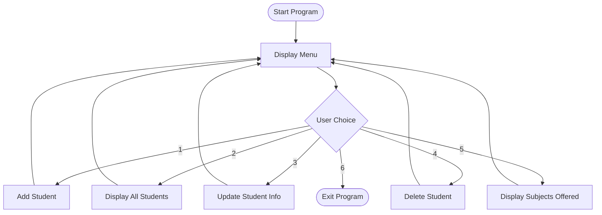

<div align="center">


<br>


</div>


<br>

<div align="center">

### 📖 Table of Contents

<table>
<tr>
<td valign="top" width="33%">

**Overview**
- [About the Project](#about-the-project)
- [Demo Video](#demo-video)
- [Features](#features)

</td>
<td valign="top" width="33%">

**Deep Dive**
- [Concepts Applied](#concepts-applied)
- [Program Flow](#program-flow)
- [Menu Walkthrough](#menu-walkthrough)

</td>
<td valign="top" width="33%">

**Getting Started**
- [Sample Run](#sample-run)
- [Tech Stack](#tech-stack)
- [Installation](#getting-started)

</td>
</tr>
<tr>
<td valign="top" width="33%">

**Reference**
- [Project Structure](#project-structure)
- [Assumptions](#assumptions)

</td>
<td valign="top" width="33%">

**Connect**
- [Author](#author)

</td>
</tr>
</table>

</div>


<br>

<h2 id="about-the-project">🧩 About the Project</h2>

**Collection Manipulator** is a console-based Python application, built as an institute project, called the **Student Data Organizer**. It's designed around one core idea: give every one of Python's built-in collection types a real, practical job to do inside a single program.

Instead of treating `List`, `Tuple`, `Set`, and `Dictionary` as separate textbook topics, this project weaves them together — a student's editable details live in a dictionary, their permanent identity lives in a tuple, their subjects live in a set to avoid duplicates, and every student record lives inside a master list. The result is a small but complete data-management tool that mirrors how real applications structure information.

<br>

<div align="center">

<h2 id="demo-video">🎬 Demo Video</h2>


*A walkthrough demo isn't recorded yet — this space is reserved for it.*

</div>

> 📌 **To add it later:** upload the video to GitHub (drag & drop into an Issue or the README editor to get a hosted link), then drop it in here as either:
>
> https://drive.google.com/file/d/1xyhzurIExlxpElj3zeH7NRmg2klkbrXs/view?usp=drivesdk
> ```markdown
> https://github.com/user-attachments/assets/your-video-id
> ```
> or as a clickable thumbnail:
> ```markdown
> [](https://your-video-link)
> ```

<br>


<br>

<h2 id="features">✨ Features</h2>

<table width="100%">
<tr>
<td width="50%" valign="top">

### 🧾 Add Student
Capture ID, name, age, grade, date of birth, and subjects — all in one guided flow.

</td>
<td width="50%" valign="top">

### 📋 Display All Students
Every record printed on a clean, single formatted line — no clutter, no guesswork.

</td>
</tr>
<tr>
<td width="50%" valign="top">

### ✏️ Update Student Information
Edit only what's meant to change — age, grade, and subjects — while ID and DOB stay locked.

</td>
<td width="50%" valign="top">

### ❌ Delete Student
Permanently remove a record using Python's `del` keyword, matched by student ID.

</td>
</tr>
<tr>
<td width="50%" valign="top">

### 📚 Display Subjects Offered
Pulls every unique subject across all students into one de-duplicated `set`.

</td>
<td width="50%" valign="top">

### 🔁 Persistent Menu Loop
Keeps running until the user chooses to exit — no restarting the script between actions.

</td>
</tr>
</table>

<br>


<br>

<h2 id="concepts-applied">🧠 Concepts Applied (In Depth)</h2>

<details>
<summary><b>📃 List — the master record book</b></summary>
<br>

Every student's dictionary is appended to a single list called `student`. This list is the backbone of the whole program — every menu option (display, update, delete) works by looping through it or indexing into it.

```python
student = []
student.append(student_data)
```
</details>

<details>
<summary><b>🔒 Tuple — the unchangeable identity</b></summary>
<br>

A student's **ID** and **date of birth** are combined into a tuple. Conceptually, these two values should never change once a student is registered — a tuple enforces that immutability at the language level.

```python
student_info = (stu_id, stu_b_date)
```
</details>

<details>
<summary><b>🎯 Set — subjects without duplicates</b></summary>
<br>

Subjects are entered as a comma-separated string and converted into a `set`, which automatically removes duplicate entries. This same technique is reused in **Display Subjects Offered**, where `.update()` merges every student's subjects into one de-duplicated collection.

```python
subject_set = set(stu_subjects.split(","))
display_subject.update(s["Subjects"])
```
</details>

<details>
<summary><b>🗂️ Dictionary — one record, many fields</b></summary>
<br>

Each student is represented as a dictionary with clear, labeled keys (`ID`, `Name`, `Age`, `Grade`, `DOB`, `Subjects`). This makes every field self-describing and easy to update by key rather than by position.

```python
student_data = {
    "ID": stu_id, "Name": stu_name, "Age": stu_age,
    "Grade": stu_grade, "DOB": stu_b_date, "Subjects": subject_set
}
```
</details>

<details>
<summary><b>🔁 Mutability vs Immutability</b></summary>
<br>

The dictionary's `Age`, `Grade`, and `Subjects` are freely reassigned during an update — demonstrating mutability. Meanwhile the tuple holding `ID` and `DOB` is never touched again after creation — demonstrating immutability, and reinforcing *why* a tuple was chosen for that data in the first place.
</details>

<details>
<summary><b>🔢 Type Casting</b></summary>
<br>

All numeric input from `input()` arrives as a string, so ID and age are explicitly cast with `int()` before being stored or compared.

```python
stu_id = int(input("student ID: "))
```
</details>

<details>
<summary><b>🗑️ The <code>del</code> Keyword</b></summary>
<br>

Deleting a student searches the list for a matching ID by index, then removes that exact entry from memory with `del student[i]` — rather than rebuilding the list or using a method like `.remove()`.
</details>

<br>


<br>

<h2 id="program-flow">🗺️ Program Flow</h2>



<br>

<h2 id="menu-walkthrough">🧭 Menu Walkthrough</h2>

**1️⃣ Add Student** → prompts for ID, name, age, grade, DOB, and subjects → builds the tuple + set → stores everything in a dictionary → appends it to `student`.

**2️⃣ Display All Students** → loops through `student` and prints each record on a single formatted line; shows a friendly message if the list is empty.

**3️⃣ Update Student Information** → asks for an ID, locates the matching record, and lets the user overwrite age, grade, and subjects.

**4️⃣ Delete Student** → asks for an ID, finds its index in the list, and removes it with `del`.

**5️⃣ Display Subjects Offered** → builds a fresh `set`, merges every student's subjects into it, and prints the de-duplicated result.

**6️⃣ Exit** → breaks the loop and ends the program.

<br>


<br>

<h2 id="sample-run">🖥️ Sample Run</h2>

<table width="100%">
<tr><td>

🔴 🟡 🟢&nbsp;&nbsp;**index.py — terminal**

```console
Welcome to the Student Data Organizer!

Select Option:
1. Add Student
2. Display All Students
3. Update Student Information
4. Delete Student
5. Display Subjects Offered
6. Exit
Enter your choice: 1

Enter student details:
student ID: 101
Name: Alice
Age: 20
Grade: B+
Date of Birth (YYYY-MM-DD): 2002-05-14
Subjects (comma-separated): Math, Science, English

Student added successfully!
```

</td></tr>
</table>

<table width="100%">
<tr><td>

🔴 🟡 🟢&nbsp;&nbsp;**output — Display All Students**

```console
--- Display All Student ---
Student ID : 101 | Name: Alice | Age: 20 | Grade: B+ | DOB: 2002-05-14 | Subjects: {'Math', 'Science', 'English'}
```

</td></tr>
</table>

> 🎥 Once the [demo video](#demo-video) is uploaded, this whole run will be viewable in motion instead of just text.

<br>


<br>

<h2 id="tech-stack">🛠️ Tech Stack</h2>


<br>

<h2 id="getting-started">🚀 Getting Started</h2>

```bash
git clone https://github.com/PalAnghan/Collection-Manipulator-RedandWhite-python.git
cd Collection-Manipulator-RedandWhite-python
python Collection-Manipulator/index.py
```

> Requires **Python 3.10+**, since the program uses the `match` statement for menu handling.

<br>


<br>

<h2 id="project-structure">📂 Project Structure</h2>

```
Collection-Manipulator-RedandWhite-python/
├── Collection-Manipulator/
│   └── index.py
└── README.md
```

<br>

<h2 id="assumptions">📝 Assumptions</h2>

- Student ID is assumed to be a unique integer entered manually by the user; no duplicate-check is enforced.
- Subjects are entered as a comma-separated string and converted into a `set` for automatic de-duplication.
- Input validation is kept minimal by design, so the project's focus stays on collection manipulation rather than defensive error handling.

<br>

---

<div align="center">

<h2 id="author">👤 About the Author</h2>


### Pal Anghan

🎓 BCA Student&nbsp; | &nbsp;🐍 Python Developer&nbsp; | &nbsp;🤖 AI-ML Enthusiast


<br>

[](https://linkedin.com/in/pal-anghan)
[](mailto:palanghan8@gmail.com)

<br>

### ⭐ If you found this project useful, consider giving it a star!


**"Quality is our Motto." — Shaping skills for scaling higher...!!!**

</div>
